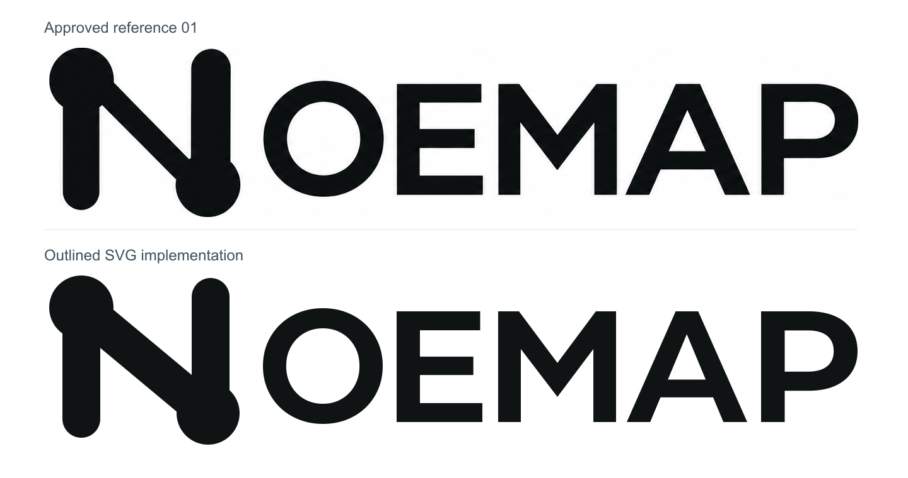
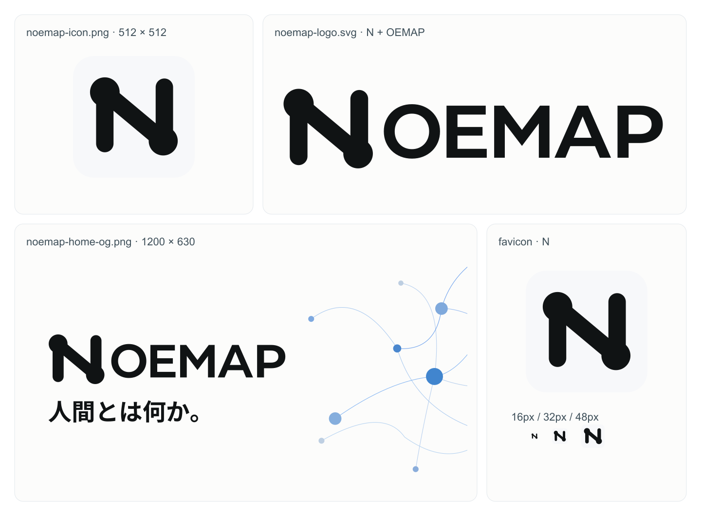
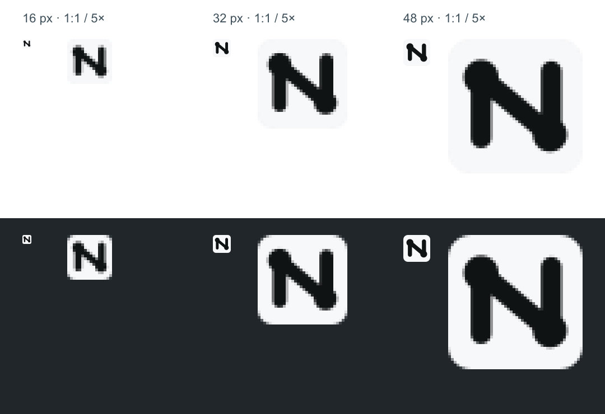
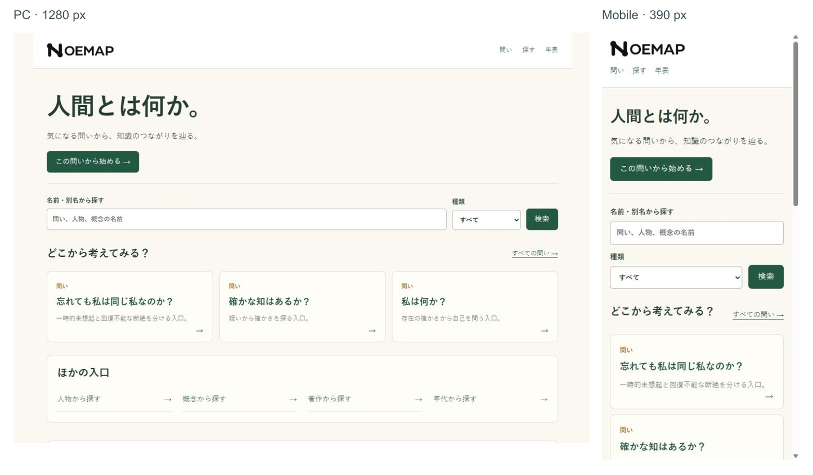

# NOEMAP ブランド素材の制作と導入

2026年10月3日。採用されたNシンボルと一体型NOEMAPロゴを、現行リポジトリ `noemap/noemap.com` の開発環境へ導入した。頭文字Nをシンボルに置き換え、続くOEMAPと合わせて6文字を読ませる。ヘッダー、アイコン、ファビコン、トップページ用SNSカードで同じ形を使う。

変更はGitHubのドラフトPRで確認し、mainと本番にはまだ反映しない。実資料を使う既存の36項目・5年代、本文、永続DB、認証、管理画面は今回の変更対象に含めない。旧リポジトリの非公開資料は移していない。

## ロゴの形と近似した部分

ユーザー提供の `01-wordmark-approved.png` を、形状、NとOEMAPの比率、太さ、字間の基準にした。画像の切り抜きを配信用素材にする代わりに、Nは縦線、斜線、左上と右下の丸い接点をつないだSVGとして描き直した。近黒の `#101314` を使い、影や光沢は加えない。

OEMAPはMontserratの可変フォントを太さ650でアウトライン化し、各字の幅、高さ、字間を参照画像に合わせて調整した。Mの中央Vの角度と深さもパスを調整している。参照画像の書体を特定したものではなく、曲線や線の太さは完全一致ではない。比較画像の上段が採用参考、下段が実装したSVGである。



横長ロゴのviewBoxは `0 0 1300 280`、シンボルは `0 0 310 280`。NをOEMAPより大きく残し、NとOの間に余白を設ける。文字はアウトラインのため、端末のフォントによって字形や字間が変わらない。

## 素材一覧

配信用素材は `public/brand`、編集用の正本と確認用画像は `design/brand` に置く。素材一覧は白系背景で用途を比較するための画像であり、サイトの実画面とは区別する。



| 配信用ファイル                                                     | 用途                           | 寸法              |
| ------------------------------------------------------------------ | ------------------------------ | ----------------- |
| [noemap-logo.svg](../public/brand/noemap-logo.svg)                 | ヘッダー用の一体型ロゴ         | 1300×280のviewBox |
| [noemap-symbol.svg](../public/brand/noemap-symbol.svg)             | Nシンボル単体                  | 310×280のviewBox  |
| [noemap-icon.png](../public/brand/noemap-icon.png)                 | 正方形アイコン                 | 512×512px         |
| [favicon.svg](../public/brand/favicon.svg)                         | 明るい背景面を持つファビコン   | 64×64のviewBox    |
| [favicon.ico](../public/brand/favicon.ico)                         | 互換用の複数サイズのファビコン | 16・32・48px      |
| [apple-touch-icon.png](../public/brand/apple-touch-icon.png)       | Apple用アイコン                | 180×180px         |
| [noemap-logo-preview.png](../public/brand/noemap-logo-preview.png) | 白背景の横長確認画像           | 1440×480px        |
| [noemap-home-og.png](../public/brand/noemap-home-og.png)           | トップページ用SNSカード        | 1200×630px        |

正方形アイコンとファビコンはNシンボルだけを使う。通常アイコンは幅の13%、小型ファビコンは10.5%の左右余白を持つ。淡い白系の背景 `#f7f8fa` をSVG、ICO、Apple用アイコンに含め、暗いブラウザー表示でも黒い形を見分けられる構成にした。



SNSカードは明るい背景の左側に共通ロゴと「人間とは何か。」を置き、右側に青系の点と曲線を添える。文字の要素はロゴと見出しの二つ。点と線は装飾であり、実際の関係データを表す図ではない。

## 正本と再生成

編集する正本は [noemap-logo-master.svg](../design/brand/noemap-logo-master.svg)、[noemap-symbol-master.svg](../design/brand/noemap-symbol-master.svg)、[og-heading.svg](../design/brand/og-heading.svg)。SNSカードの配置、背景、点と曲線、アイコンの余白は [生成スクリプト](../scripts/build-brand-assets.mjs)で管理する。

リポジトリのルートで実行する。

```sh
npm ci
npm run brand:build
```

スクリプトは正本から配信用SVG、PNG、ICO、SNSカード、素材一覧を再生成する。SNSカードのSVGも `design/brand/noemap-home-og-master.svg` に出力する。PNGの描画には開発依存のSharp 0.35.5を使用し、依存の解決結果は `package-lock.json` に保存する。外部画像や書体ファイルの取得は再生成に不要である。

出力だけを編集すると再生成で上書きされるため、形はSVGの正本、配置はスクリプトを変更する。比較画像、ファビコンの確認画像、実装後のスクリーンショットは確認資料であり、`brand:build` の配信用出力とは別に管理する。

## 書体とライセンス

| 用途                    | 書体と太さ       | 公式の配布元とライセンス                                                                                                                                      |
| ----------------------- | ---------------- | ------------------------------------------------------------------------------------------------------------------------------------------------------------- |
| OEMAPのアウトライン     | Montserrat 650   | [Google Fontsの配布元](https://github.com/google/fonts/tree/main/ofl/montserrat)、[OFL本文](https://github.com/google/fonts/blob/main/ofl/montserrat/OFL.txt) |
| SNSカードの日本語見出し | Noto Sans JP 700 | [Google Fontsの配布元](https://github.com/google/fonts/tree/main/ofl/notosansjp)、[OFL本文](https://github.com/google/fonts/blob/main/ofl/notosansjp/OFL.txt) |

両書体のライセンスはSIL Open Font License 1.1。[フォント情報](../design/brand/font-information.json)に取得元、版、使用したファイルのSHA-256を記録し、ライセンス本文を [Montserrat](../design/brand/Montserrat-OFL.txt) と [Noto Sans JP](../design/brand/NotoSansJP-OFL.txt) のファイルとして保存した。書体は制作時に使い、サイトにはアウトラインとPNGを配信する。書体ファイルの配信や外部フォントへの通信は追加していない。

## サイトへの適用範囲

現行mainを読んだうえで [layout.tsx](../src/app/layout.tsx)、[page.tsx](../src/app/page.tsx)、[globals.css](../src/app/globals.css) へ必要な差分を適用した。ローカル時だけの注意表示と編集ナビ、環境に応じたrobots、aboutへの案内、フッターは保持する。

ヘッダーは白背景とし、ホームへ戻るロゴリンクの名前を「NOEMAP ホーム」にした。SVGを `next/image` で直接読み、固有比率1300×280とCSSの高さ32px・幅autoで表示する。480px以下では既存のナビゲーションを次の行へ送る仕様を使う。本文とカードの色は変更しない。

ファビコンとApple用アイコンをレイアウトのMetadata APIで設定する。`metadataBase` は現行READMEに記載された公開先 `https://noemap.com`。SNSカードはトップページだけのOG画像として1200×630px、説明「NOEMAP — 人間とは何か。」を指定し、Twitterカードを `summary_large_image` にした。他ページに同じOG画像を一律に設定する変更はない。

トップの表示コピーは「人間とは何か。」「気になる問いから、知識のつながりを辿る。」「どこから考えてみる？」とする。Nodeのタイトルや本文、検索、既存の問いカード、関係図、記事への移動は維持する。参考画像の8大テーマを展開するUIは現行アプリにも未実装であり、今回のロゴ導入では探索構造を変更しない。

## 確認結果と未確認の範囲

既存の公開データと編集機能の試験を使い、ブランド導入後の動作を確認した。基準はmainの `416b3c7e5b3ebbeacf1d1a724c53db0b858ce848`。本番DBの接続設定を入れず、同梱の公開データを使ったローカルの本番用ビルドで確認している。

| 確認                    | 結果                                                                                                                                             |
| ----------------------- | ------------------------------------------------------------------------------------------------------------------------------------------------ |
| `npm run test:release`  | 32項目通過。公開データ21項目と暫定表示11項目                                                                                                     |
| `npm run test:editor`   | 47項目通過。公開取得25項目、永続保存7項目、編集6項目、管理フォーム9項目                                                                          |
| `npm run format:check`  | 全体の整形確認を通過                                                                                                                             |
| `npm run typecheck`     | 型確認を通過                                                                                                                                     |
| `npm run build`         | 公開データのハッシュ確認、生成、本番用ビルドが成功                                                                                               |
| 公開HTTP                | 10項目通過。36項目の全経路、出典、検索、5年代、紹介、公開indexとローカル編集画面の遮断を確認                                                     |
| 素材取得とメタデータ    | 8素材が200応答し、保存したファイルとバイト単位で一致。トップの絶対OG画像URL、1200×630、画像説明、Twitterカード、3アイコン参照を確認              |
| 他ページのOG            | 人物、問い、紹介ページにトップのSNSカードが追加されていないことを確認                                                                            |
| PC 1280px、390px、320px | ロゴ高さ32px・原比率で表示。ナビとの重なり、ページの横はみ出し、画像の読込失敗なし                                                               |
| 操作とブラウザー        | トップから問い、ロゴからホーム、David Humeの検索、人物、著作へ移動。警告とエラーログは0件                                                        |
| SVGとアイコン           | Nシンボル1個＋OEMAPの5輪郭、接点2個。ビットマップ、外部フォント、外部依存なし。ICO16・32・48pxをデコードし、同じシンボルから生成されることを確認 |

PC・390px・320pxの実装後の画像を以下に保存した。表示幅はブラウザーで指定した値であり、保存画像にはブラウザーの画面キャプチャー処理による寸法差がある。生成された参考掲載イメージと、実際に動作するサイトのスクリーンショットを区別する。

- [PCの実画面](../design/brand/noemap-brand-desktop.jpg)
- [390pxの実画面](../design/brand/noemap-brand-mobile-390.jpg)
- [320pxの実画面](../design/brand/noemap-brand-mobile-320.jpg)



実測値と素材のハッシュは [素材取得と検証の記録](validation/brand-integration-results.json)、表示寸法と操作の記録は [ブラウザー確認](validation/brand-browser-results.json)に保存した。アプリにはダークモードのスタイルがなく、ヘッダーは常に白背景。ファビコンは白と暗い背景で実寸と拡大像を見比べた。

## 変更ファイル

- サイト表示：`src/app/layout.tsx`、`src/app/page.tsx`、`src/app/globals.css`
- 再生成と依存：`scripts/build-brand-assets.mjs`、`package.json`、`package-lock.json`。整形確認に生成スクリプトを追加した。
- 配信：素材一覧にある `public/brand` の8ファイル
- 正本と制作情報：`design/brand` のロゴ、シンボル、見出し、SNSカードのSVG、`font-information.json`、2書体のOFL本文
- 確認画像：`design/brand` の素材一覧、採用参考との比較、ファビコン、PC・390px・320pxの実画面、実画面の比較一覧
- 引き継ぎ：本書、`README.md` の案内1行、`docs/validation` のブランド確認記録2ファイル

外部SNSのキャッシュ更新と実際のカード表示、本番ドメイン上での新しい素材取得は未確認である。mainへの反映と本番公開は別工程とし、今回の開発環境での確認を本番反映の完了とは扱わない。
